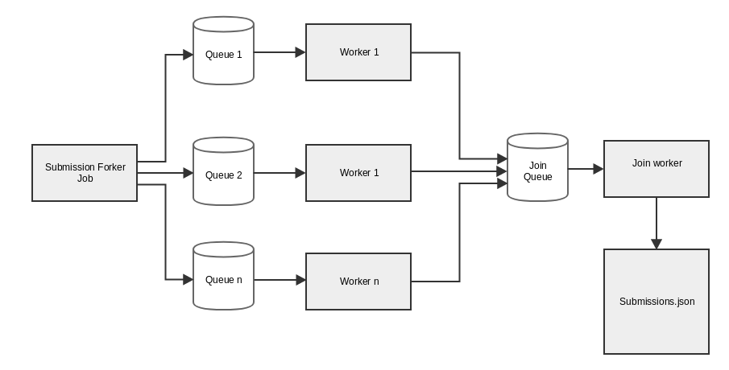

# Submission Exporter

Application in charge of execute export task for different purposes 

## Jobs
### 1. Full export
General .json file by processing the full list of submissions



#### Submission Forker Job
Query the full list of submissions and distribute between workers processing queues.

#### Worker Job
Take basic submission information, query submissions sections, links and attributes and generate json representation. Submit to Join queue after complete the process.

#### Join worker
Get the full list of submissions json representation and merge into single out file.


### 2. Partial export
Identify new submissions create json file whit their content and notify configured url.

## Execution example

compile application using gradle 

```
  ./gradlew clean build
```

Run generated jar in ``build/libs`` folder 


```
java -jar exporter-0.0.1-SNAPSHOT.jar --application.queryModified=" limit 1"
```
